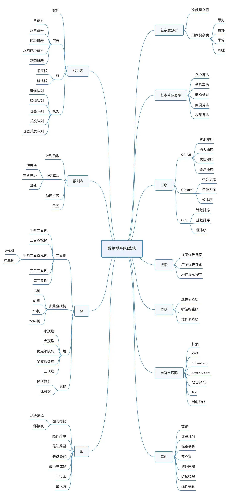

#  数据结构与算法 真正的软件工程师的第一课
 事实上不论是什么技术 数据结构和算法都是基石

数据结构与算法没有捷径

很明显我们现在很幸运 有大量的教材 以及图画 leetcode等练习网站

但依然没有捷径 要做好付出100小时甚至更多时间的努力

数据结构是为算法服务的，算法要作用在特定的数据结构之上

反复迭代 刷题练习 知识复利

学习模型

what why how

是什么? 为什么? 怎么做