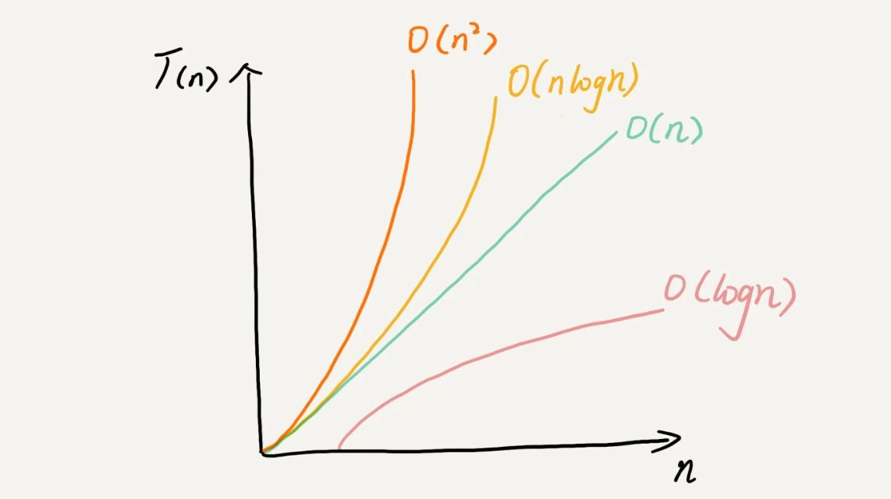

#时空复杂度分析 
##为什么需要时间空间复杂度分析
   数据结构与算法本质 解决快和省的问题

   通过大概的公式计算出数据规模 时间规模模型

   同时摆脱机器环境 等对结果的影响
##大O时间复杂度表示法
如何不通过测试 肉眼来识别其复杂度那?
```java
 int cal(int n) {
   int sum = 0;
   int i = 1;
   for (; i <= n; ++i) {
     sum = sum + i;
   }
   return sum;
 }
```
每一行的代码我们粗略的认为执行时间为

unit_time
在这个假设的基础上

第一第二行代码 执行时间为 2*unit_time

第四五行代码分别执行了n边 为 2n*unit_time

总的时间复杂度为(2n+2)*unit_time

n为未知的数据规模

```java
 int cal(int n) {
   int sum = 0;
   int i = 1;
   int j = 1;
   for (; i <= n; ++i) {
     j = 1;
     for (; j <= n; ++j) {
       sum = sum +  i * j;
     }
   }
 }
```
3+2n+2n2

T(n) = (2n2+2n+3)*unit_time

大O复杂度表示法：T(n)=O(f(n)) 

N:数据规模的大小  cal(n) 

F(n)代码执行次数的总和 3+2n+2n2=F(n)

T(n) 代码执行时间的总和 T(n)=O(f(n)) 

O 每行代码的执行时间 O = unit_time

T(n)=(2n2+2n+3) 成正比

同时只关注 数据规模 T(n)=O(2n2)

## O(1)

一般来说只要没有循环语句不管有多少行都是O(1)
理解挺简单的

## O(logn) O(nlogn)
挺绕的当初晕了好一会(数学没学好教的学费)

```java
 i=1;
 while (i <= n)  {
   i = i * 2;
 }
```
分析循环次数最多的代码为 第三行

我们发现 数据规模并不是 简单的 循环了 n次

当i>n 时循环结束 i每次*2 

第三行代码并没有从1到n都执行了一次，而是跳跃着执行的，所以其执行次数不是n

，即时间复杂度不是O(n)。 而是O(logn)

(Onlogn) 即为一段 O(logn)的代码执行了N次

##O(m+n)、O(m*n)

代码的复杂度由两个数据的规模来决定

```java

int cal(int m, int n) {
  int sum_1 = 0;
  int i = 1;
  for (; i < m; ++i) {
    sum_1 = sum_1 + i;
  }

  int sum_2 = 0;
  int j = 1;
  for (; j < n; ++j) {
    sum_2 = sum_2 + j;
  }

  return sum_1 + sum_2;
}
```
O(m+n)



##最好情况时间复杂度
很好理解 查找算法的 第一个 元素如果是 要查找的元素

就会提前返回 即为O(1)

##最坏情况时间复杂度
很好理解 查找算法的 最后的 元素如果是 要查找的元素

即为O(N)

##均摊时间复杂度

平面展开分析即可 